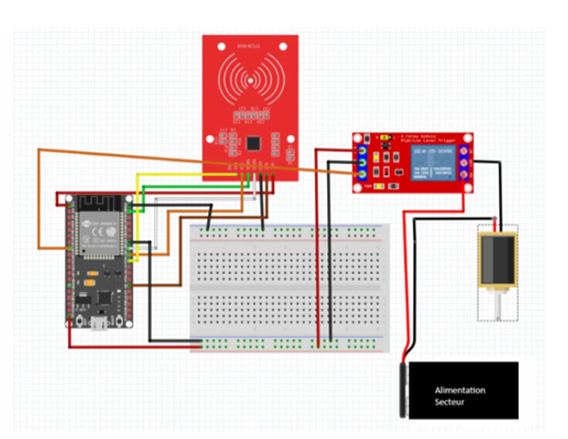
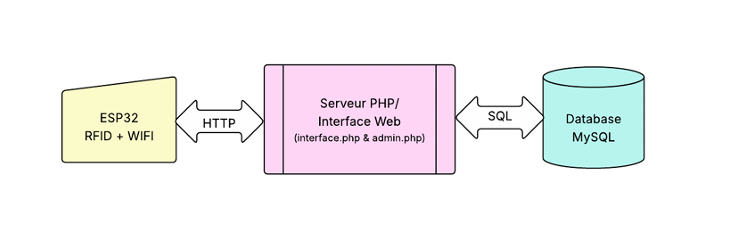
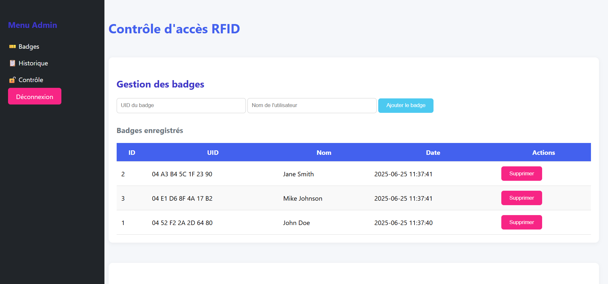

# Sistema Automatizado de Control de Acceso IoT

## Descripción General
Este proyecto se centra en el diseño e implementación de un sistema seguro de control de acceso basado en IoT, utilizando ESP32, módulo RFID RC522 y una cerradura eléctrica. El sistema integra componentes de hardware con una interfaz web en PHP/MySQL para gestionar credenciales RFID y monitorear registros de acceso. El proyecto fue desarrollado como parte del curso "Industrie 4.0 et Usine Future" entre abril de 2025 y junio de 2025.

## Características
- **Control de acceso seguro**: Autenticación por RFID con ESP32 y RC522.
- **Interfaz web**: Panel PHP/MySQL para administrar credenciales y consultar bitácoras de acceso.
- **Integración de hardware**: Control de relé para cerradura eléctrica y pruebas funcionales en entorno local.
- **Registro en tiempo real**: Guarda los intentos de acceso y su estado (GRANTED/DENIED).

## Materiales Utilizados
- **ESP32**: Microcontrolador para conectividad WiFi y procesamiento RFID.
- **Módulo RFID RC522**: Lectura de tarjetas RFID.
- **Módulo de relé**: Control de la cerradura eléctrica.
- **Cerradura eléctrica**: Control de acceso físico.
- **Fuente de alimentación de 12V**: Alimentación de cerradura y relé.
- **XAMPP**: Entorno local de servidor para PHP/MySQL.

## Arquitectura del Sistema
1. **Escaneo de tarjeta RFID**: El módulo RC522 lee la tarjeta y envía el UID al ESP32.
2. **Comunicación con servidor**: El ESP32 se comunica con la API en PHP alojada localmente.
3. **Decisión de acceso**: El servidor valida el UID en la base de datos y responde GRANTED o DENIED.
4. **Control del relé**: Si el acceso es válido, se activa el relé para abrir la cerradura.
5. **Registro**: Todos los intentos de acceso se almacenan en MySQL.

### Diagrama de Conexión de Hardware


Este diagrama muestra las conexiones entre ESP32, módulo RC522, relé y cerradura eléctrica. También incluye el esquema de alimentación del sistema.

### Diagrama de Flujo del Sistema


Este diagrama presenta una vista general del flujo del sistema y cómo el ESP32 se comunica con el servidor PHP y la base de datos MySQL para administrar accesos.

## Interfaz Web
### Página de Inicio de Sesión


La página de inicio de sesión permite al administrador autenticarse y acceder al panel.

### Panel de Control


El panel permite:
- Agregar y eliminar credenciales RFID.
- Consultar historial de accesos.
- Controlar manualmente la apertura de la puerta.

## Explicación del Código Arduino
El archivo `code-iot.ino` contiene la lógica para:
- **Conexión WiFi**: Conecta el ESP32 a la red local.
- **Escaneo RFID**: Lee el UID de las tarjetas RFID.
- **Comunicación con servidor**: Envía el UID a la API PHP y procesa la respuesta.
- **Activación de relé**: Activa el relé para abrir la puerta durante un tiempo definido.

### Funciones Clave
- `setup()`: Inicializa el módulo RFID, la conexión WiFi y el relé.
- `loop()`: Escanea tarjetas continuamente y gestiona la comunicación con el servidor.
- `activateRelay(duration)`: Activa el relé durante el tiempo indicado.

## Cómo Ejecutar el Proyecto

### Opción A - Docker (recomendada)

Este es el método recomendado. No requiere instalación de XAMPP.

#### Requisitos Previos
- [Docker Desktop](https://www.docker.com/products/docker-desktop) instalado y en ejecución.
- WSL2 habilitado en Windows (`wsl --install` en PowerShell como administrador y luego reiniciar).

#### Pasos

1. **Clonar el repositorio**:
   ```bash
   git clone <repo-url>
   cd IOT-door-lock
   ```

2. **Configurar la contraseña de base de datos** (opcional, ya existe un valor por defecto):
   ```bash
   # Edita .env si quieres cambiar la contraseña root de MySQL
   DB_PASS=rfid_secure_pass
   ```

3. **Levantar los servicios**:
   ```bash
   docker compose up --build -d
   ```
   Esto hará lo siguiente:
   - Descarga imágenes de PHP 8.1 + Apache y MySQL 8.0.
   - Crea automáticamente la base `rfid_access` y sus tablas (`db/init.sql`).
   - Expone la aplicación web en **http://localhost**.

4. **Abrir el panel de administración**:
   Ingresa a **http://localhost/admin.php**
   Credenciales por defecto: `admin` / `admin123`

5. **Detener los servicios**:
   ```bash
   docker compose down
   ```

6. **Configurar el ESP32**:
    - Preferiblemente usa el nombre del equipo donde corre Docker o XAMPP en lugar de una IP fija.
    - En `src/arduino/code-iot.ino` configura estas constantes:
       ```c
       const char* serverHost = "<PC_HOSTNAME>";
       const uint16_t serverPort = 80;
       const char* serverPath = "/api.php";
       ```
    - Ejemplo en Windows: si el comando `hostname` devuelve `Eduardo`, el ESP32 usara `http://Eduardo:80/api.php`.
    - Si la red del laboratorio no resuelve nombres locales, usa una de estas alternativas:
       - Reserva DHCP para que tu PC siempre reciba la misma IP.
       - Configura una IP estatica en la PC dentro de una red controlada.
       - Usa un router o hotspot propio para las pruebas.
    - Sube el sketch al ESP32 y revisa el monitor serial. El firmware ahora informa si pudo resolver el host del servidor.

#### Mapa de Servicios Docker

| Servicio | Contenedor | Puerto |
|---|---|---|
| PHP 8.1 + Apache | `rfid-web` | 80 -> 80 |
| MySQL 8.0 | `rfid-db` | Solo interno |

---

### Opción B - XAMPP (legado)

1. **Configuración de hardware**:
   - Conecta el módulo RFID RC522 y el relé al ESP32.
   - Conecta la cerradura eléctrica al relé.
   - Alimenta el sistema con una fuente de 12V.

2. **Configuración de software**:
   - Instala XAMPP e inicia Apache y MySQL.
   - Coloca los archivos PHP (`index.php`, `api.php`, `admin.php`) dentro de `htdocs`.
   - Importa `db/init.sql` en MySQL para crear el esquema `rfid_access`.

3. **Código Arduino**:
   - Sube `src/arduino/code-iot.ino` al ESP32.
   - Actualiza las credenciales WiFi y la URL del servidor en el código.

4. **Pruebas**:
   - Escanea tarjetas RFID y monitorea los registros desde la interfaz web.
   - Prueba la activación del relé y la cerradura eléctrica.

## Conclusión
Este proyecto demuestra la integración de conceptos de IoT e ingeniería industrial para construir un sistema de control de acceso funcional y seguro. La combinación de hardware y software permite monitoreo y gestión de accesos en tiempo real, siendo útil para edificios inteligentes y entornos industriales.
